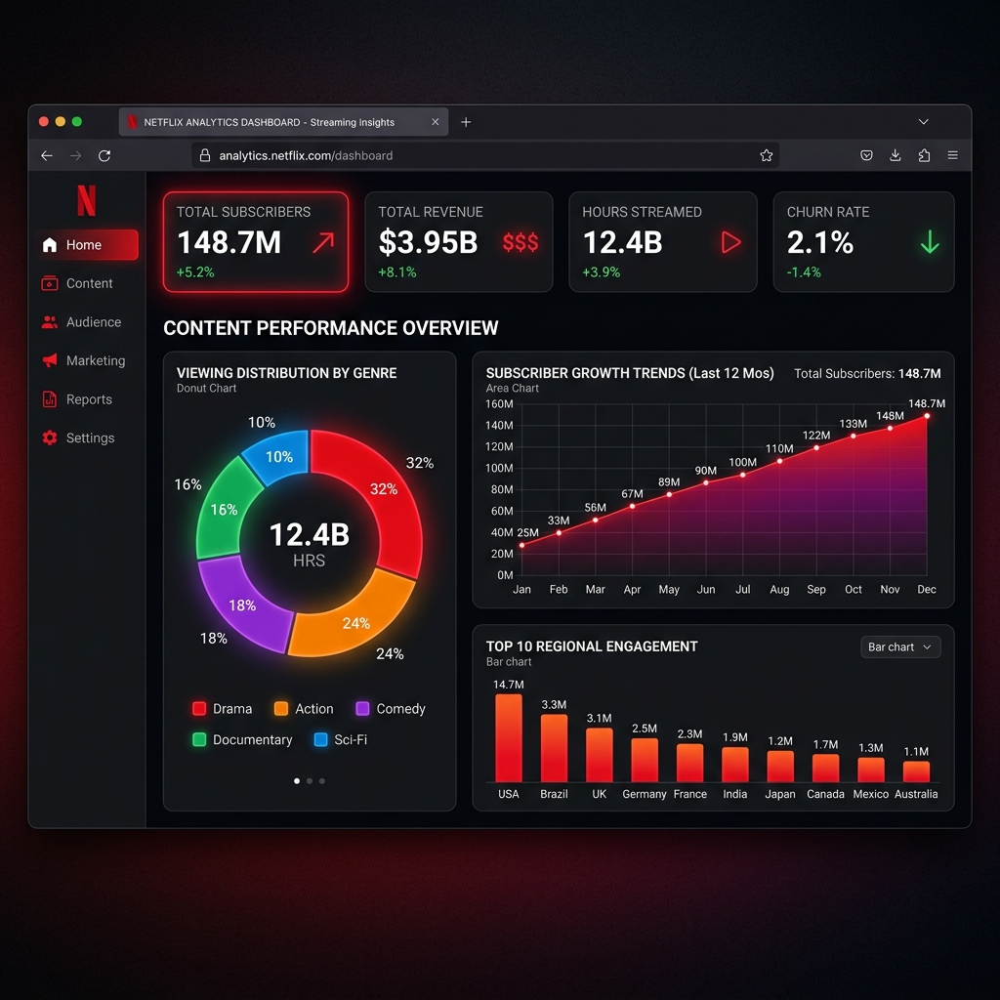

# 🎬 Netflix Movies & TV Shows Analytics Dashboard



## 📌 Executive Summary
This project is an advanced, premium, and highly interactive **Netflix Analytics Dashboard** built from scratch using React and Vite. It features a cinematic dark UI with a vibrant multi-color palette. The application dynamically parses raw Netflix CSV data and calculates complex business metrics on the fly, rendering stunning visualizations without relying on proprietary BI tools.

## 📸 Dashboard Screenshots
- **Overview:** ``

## 🎯 Business Questions Answered
- **Growth Over Time:** How has Netflix’s library expanded year-over-year? (Area Chart)
- **Content Strategy:** What is the ratio between Movies and TV Shows? (Donut Chart)
- **Global Reach:** Which countries produce the most content? (Bar Chart)
- **Audience Preferences:** Which genres dominate the platform? (Bar Chart)
- **Maturity Targeting:** How do content ratings distribute? (Column Chart)
- **Key Contributors:** Who are the top directors fueling the library? (Bar Chart)

## 🛠️ Tech Stack
- **Frontend Framework:** React 18, Vite
- **Data Visualization:** Recharts (SVG-based charting library)
- **Data Engineering/Processing:** PapaParse (for in-browser CSV parsing)
- **Styling:** Vanilla CSS (Glassmorphism, CSS Grid, Flexbox, Custom Dark Theme)
- **Icons:** Lucide React

## 🚀 How to Run Locally

1. Clone this repository:
   ```bash
   git clone https://github.com/yourusername/netflix-analytics-dashboard.git
   ```
2. Navigate to the project directory:
   ```bash
   cd netflix-analytics-dashboard
   ```
3. Install the dependencies:
   ```bash
   npm install
   ```
4. Start the development server:
   ```bash
   npm run dev
   ```
5. Open your browser and visit `http://localhost:5173/`

## 📈 Data Processing Architecture
The dashboard reads from `netflix_titles.csv` in the public directory. Upon mounting, `dataProcessor.js` asynchronously streams the CSV data, cleanses null values, handles multi-value comma-separated strings (like multiple directors/genres per row), and aggregates the final arrays used for the visual components.

---
*Created as a comprehensive portfolio project demonstrating Frontend Development, Data Analytics, and UI/UX skills.*
